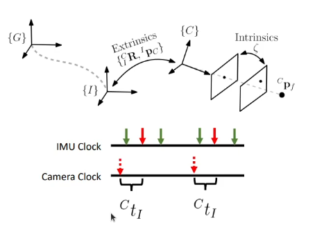
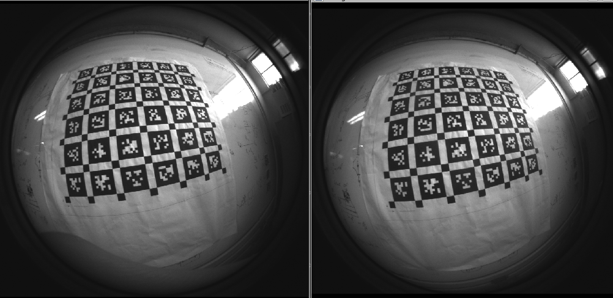
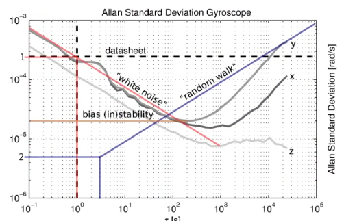

# Calibration Problem to VIO Systems

## Introduction

Calibration is the process of determining the relationship between sensors. Basically, we have to obtain some certain parameters that allow us to transform the measurements of one sensor to the reference frame of another sensor. 

- There exist two types of calibration: online and offline calibration:
  - Online calibration: The calibration is performed during the operation of the system. This means that the calibration is performed in real-time.
  - Offline calibration: The calibration is performed before the operation of the system. This means that the calibration is performed in a controlled environment.

## The process

The calibration was done using the following steps:

- **Data Collection**: Using ROS and a T265 Realsense Camera(fisheye), it was collected
  - 1 dataset of IMU measuremnts(16 hours) in rosbag format;
  - 1 dataset of stereo fisheye images(2 minutes) in rosbag format;
  - 1 dataset of fisheye images and IMU measurements(2 minutes) in rosbag format.

- **Data Preprocessing**: The data was preprocessed using the following steps:
  - Used a IMU Allan variance Tool to obtain the IMU parameters;
  - Used the Kalibr toobox to obtain the fisheye camera parameters and the corresponding IMU-camera extrinsics. In order to do this, it was used a aprilgrid calibration target.

Results:

### Camera intrinsics:

- Low reprojection error and relative small variance, which means that the calibration was successful.
- The camera error is a gaussion distribution. If it wasn't the camera model used could be wrong or the calibration was not successful.

### IMU Noise:

We need to recover these parameters to make sure that when the camera and IMU are fused, the noise is minimized, trusting the camera as much as we should and the IMU as much as we should.

### Camera-IMU Extrinsics:

To this, I ensured both smoth and non jerking trajectory and covered all IMU axis. Also non constant acceleration and rotation.